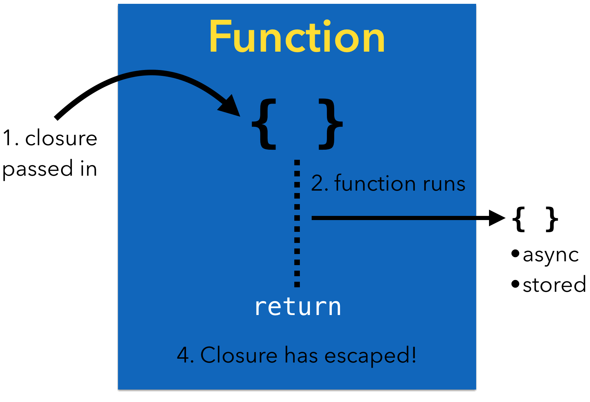

<br/><br/>


## `@escaping` 키워드는 언제 사용하는 것일까?

<br/>

### 목차
- [`@escaping`키워드는 주로 두 가지 경우에서 사용된다]()
- [내부의 closure를 외부 변수에 저장하는 경우]()

<br/>

#

### `@escaping`키워드는 주로 두 가지 경우에서 사용된다

<br/>

&nbsp;&nbsp;&nbsp;&nbsp;<br/><br/>

1. 어떤 함수의 내부에 존재하는 closure를 외부 변수에 저장하는 경우
2. GCD(비동기 코드)를 활용해야하는 경우

<br/>

#

### 내부의 closure를 외부 변수에 저장하는 경우

<br/>


```swift
var aSavedFunction: (() -> ())?

func performEscaping(closure: @escaping() -> ()) {
    aSavedFunction = closure //클로저를 실행하는 것이 아닌 외부 변수 aSavedFunction 에 저장
}
```

1. `performEscaping()`의 경우 단순히 Stack에 올라갔다 사라지는 것이 아닌 외부 변수(Heap 메모리)에 클로저를 넣고있다.
2. 이때 Stack frame을 벗어나서 Heap에 내부 closure를 할당하고 있다는 것을 알려주어야 하는데 이때 `@escaping`키워드를 활용한다
3. 단순히 말하자면 함수 내부의 closure(함수)를 더 길게 사용하고 싶을 때 쓰는 키워드이다.

<br/>

#

### GCD 비동기 코드를 사용하는 경우

```swift
func performEscaping(closue: @escaping() -> ()) {

    let name = "suojae"

    DispathcQueue.global().async {
        closure()
    }
}
```

1. `DispathcQueue()`는 기본적으로 2번 thread에게 일을 시키는 code이다.
2. 이때 closure를 2번 thread(2번 Stack)에게 일을 시키기 위해서는 main thread(1번 Stack)에서 곧바로 2번 stack에 `closure()'을 보낼 수 없다
3. 중간다리로 Heap에 저장해두고 1번 Stack(main thread) -> Heap -> 2번 Stack(2nd thread) 으로 진행되는데 이를 위해 `@escaping` 키워드가 사용된다.
